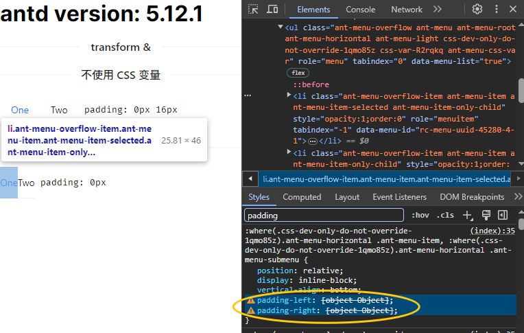

# CSS变量模式下 `legacyLogicalPropertiesTransformer` 转换错误 / 丢失 （Next.js 复现 Demo)

## Run

```bash
pnpm install

pnpm dev
```

## 复现 Demo 搭建步骤

1. 新建工程

```bash
pnpm dlx create-next-app

pnpm install antd @ant-design/cssinjs ahooks
```

2. 添加 Registry

> https://ant.design/docs/react/use-with-next-cn#%E4%BD%BF%E7%94%A8-app-router

3. 增加 Menu 组件

## 问题：

启用 `legacyLogicalPropertiesTransformer` + `CSS 变量` 的组件

转换异常


